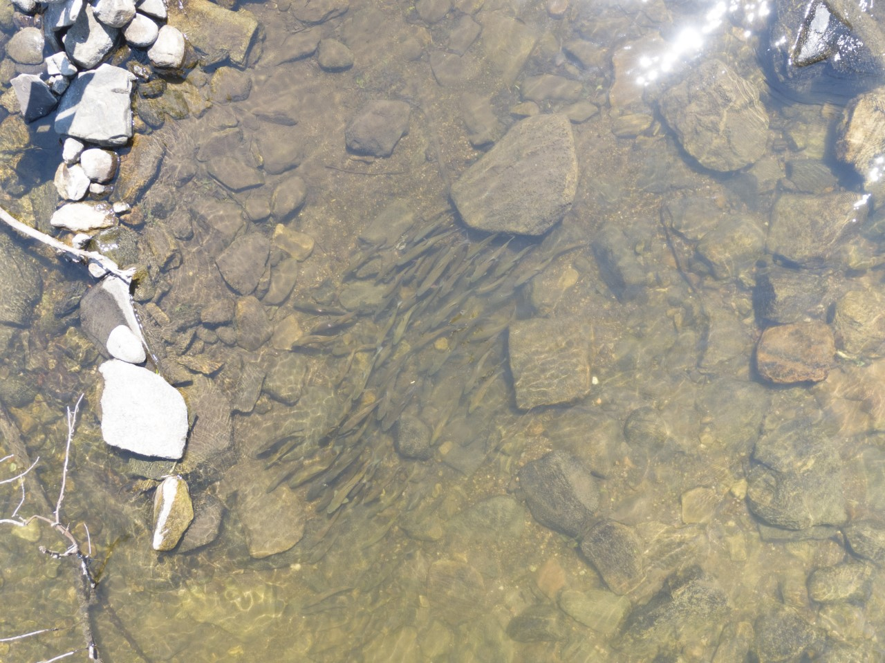
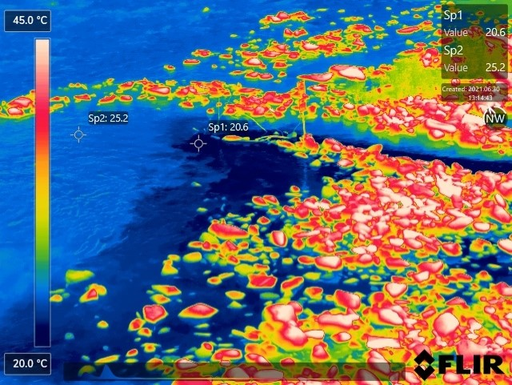

class: inverse, center, middle

# Thermal Refuges

## 2021 SESYNC Summer Institute

### [Kathryn Smith](https://twitter.com/smithakathryn)      
### [Francine Mejia](https://scholar.google.com/citations?user=STn9DqkAAAAJ&hl=en) 

---
background-image: url(https://www.sesync.org/sites/default/files/cold_water_refuge_zoom_image.png)
background-position: 50% 50%

# [SESYNC Workshop](https://www.sesync.org/news/thu-2021-03-25-1322/closing-the-gap-between-the-science-and-management-of-cold-water-refuges)


```{r setup, include=FALSE}
options(htmltools.dir.version = FALSE)
knitr::opts_chunk$set(echo = TRUE)
```

```{r, include = FALSE}
#Load  libraries
library("pdftools")
library("quanteda")
library("ggplot2")
library("quanteda.textstats")
library("tm")
library("magrittr")
library("knitr")
library("tidytext")
library("dplyr")
library("quanteda.textplots")
library("topicmodels")
```
---
# Thermal Refuges

.pull-left[


```{r, echo=FALSE,out.width = "400px"}

```
]

.pull-right[


```{r, echo=FALSE,out.width = "400px"}

```
]

.footnote[
Photo Credit: Martin Briggs, USGS
]
---
# Mini-project Goals
The overall goals for this week:

- Practice preforming text analysis in R using pdf policy documents from New Brunswick & Oregon;

- Write a reproducible pipeline that can be applied to other case studies;

```{r,echo = FALSE, out.width='100%', fig.height=4, eval=require('leaflet')}
library(leaflet)
leaflet() %>% addTiles() %>% setView(-93.65, 42.0285, zoom = 3.5) %>% 
  addMarkers(lng = -120.674824, lat = 43.698567) %>% addMarkers(lng = -66.306390, lat = 46.557810)
```
---

# Reading in PDF Documents

```{r, include = FALSE}
#Load  in data from Oregon
setwd('C:/Users/kathr/OneDrive/Documents/thermal-refuges-text/data/oregon')
working <- 'C:/Users/kathr/OneDrive/Documents/thermal-refuges-text/data/oregon'
getwd() #Double checks the working directory

files <- list.files(pattern = "pdf$")
corp <- VCorpus(DirSource(working),
                  readerControl = list(reader = readPDF))
pdf_corpus <- corpus(corp)
```

```{r, include = FALSE}
#Load in data from New Brunswick
setwd('C:/Users/kathr/OneDrive/Documents/thermal-refuges-text/data/newbrunswick')
working <- 'C:/Users/kathr/OneDrive/Documents/thermal-refuges-text/data/newbrunswick'
getwd() #Double checks the working directory

files_nb <- list.files(pattern = "pdf$")
corp_nb <- VCorpus(DirSource(working),
                  readerControl = list(reader = readPDF))
pdf_corpus_nb <- corpus(corp_nb)
```

Using the "tm" and "quanteda" R package
```r
library("tm")
files <- list.files(pattern = "pdf$")
corp <- VCorpus(DirSource(working),
                  readerControl = list(reader = readPDF))
               
library("quanteda")
pdf_corpus <- corpus(corp)
```
```{r}

length(pdf_corpus)

length(pdf_corpus_nb)
```
---

# Filter Data

```{r, include = FALSE}
# remove stopwords, punctuation, number, URLs, and separators
wordsquant <- pdf_corpus %>%  
  tokens(remove_punct = TRUE,
         remove_symbols = TRUE,
         remove_numbers = TRUE,
         remove_url = TRUE,
         remove_separators = TRUE)

# remove stopwords and stem words, and make everything lowercase
wordsquant <- wordsquant %>%
  tokens_select(stopwords('english'), selection='remove') %>% 
  tokens_wordstem() %>% 
  tokens_tolower()


# remove stopwords, punctuation, number, URLs, and separators in NB
words <- pdf_corpus_nb %>%  
  tokens(remove_punct = TRUE,
         remove_symbols = TRUE,
         remove_numbers = TRUE,
         remove_url = TRUE,
         remove_separators = TRUE)

# remove stopwords and stem words, and make everything lowercase in NB
words <- words %>%
  tokens_select(stopwords('english'), selection='remove') %>% 
  tokens_wordstem() %>% 
  tokens_tolower()
```

Remove punctuation, symbols, numbers, URLs, and separators
```r
wordsquant <- pdf_corpus %>%  
  tokens(remove_punct = TRUE,
         remove_symbols = TRUE,
         remove_numbers = TRUE,
         remove_url = TRUE,
         remove_separators = TRUE)
```
Remove stopwords, stem words, and make everything lowercase
```r
wordsquant <- wordsquant %>%
  tokens_select(stopwords('english'), selection='remove') %>% 
  tokens_wordstem() %>% 
  tokens_tolower()
```
---

# Term Frequency
.pull-left[
Oregon:

```{r, echo = FALSE, fig.width=6, fig.align="left"}
# Document-Term Matrix
term_matrix <- dfm(wordsquant)

# term frequency
pdf_freq <- textstat_frequency(term_matrix, n = 20) 

# plot term frequency
ggplot(pdf_freq, aes(x = rank, y = frequency)) +
  geom_point() +
  labs(x = "Frequency Rank", y = "Term Frequency") +
  theme_minimal() + 
  theme(panel.border = element_rect(fill='NA', color='black'),
        axis.ticks = element_line(),
        legend.title = element_blank(), 
        axis.title = element_text(size=16), 
        axis.text = element_text(size=14, color = 'black'))
```
]

.pull-right[
New Brunswick:

```{r, echo = FALSE, fig.width=6, fig.align="right"}
# Document-Term Matrix
term_matrix_nb <- dfm(words)

# term frequency
pdf_freq_nb <- textstat_frequency(term_matrix_nb, n = 20) 

# plot term frequency
ggplot(pdf_freq_nb, aes(x = rank, y = frequency)) +
  geom_point() +
  labs(x = "Frequency Rank", y = "Term Frequency") +
  theme_minimal() + 
  theme(panel.border = element_rect(fill='NA', color='black'),
        axis.ticks = element_line(),
        legend.title = element_blank(), 
        axis.title = element_text(size=16), 
        axis.text = element_text(size=14, color = 'black'))
```
]

---

# Creating a Dictionary

```r
dict <- dictionary(list(temperature = c("temperatur*"),
                        coldwater = c("cold*"), 
                        salmonids = c("salmon*", "brown", 
                              "cutthroat", "trout", "rainbow", 
                              "bull", "atlantic", "brook"),
                        refuge = c("refug*")))
```
```{r, include = FALSE}
##creating your own dictionary
dict <- dictionary(list(temperature = c("temperatur*"),
                        coldwater = c("cold*"), 
                        salmonids = c("salmon*", "brown", "cutthroat", "trout", "rainbow", "bull", "atlantic", "brook"),
                        refuge = c("refug*")))
```

```{r}
print(dict)
```
---

# Frequency of Dictionary Terms

.pull-left[
Oregon:

```{r, echo = FALSE}
#Oregon
#Get tokens
toks <- tokens(wordsquant)
##creating your own dictionary
dict <- dictionary(list(temperature = c("temperatur*"),
                        coldwater = c("cold*"), 
                        salmonids = c("salmon*", "brown", "cutthroat", "trout", "rainbow", "bull", "atlantic", "brook"),
                        refuge = c("refug*")))

dict_toks <- tokens_lookup(toks, dictionary = dict)

dfmat <- dfm(toks)

dfmatdict <- dfm_lookup(dfmat, dictionary = dict, levels = 1)

dfmatdict %>% 
  textstat_frequency(n = 14) %>% 
  ggplot(aes(x = reorder(feature, frequency), y = frequency)) +
  geom_bar(stat="identity", width=0.2, color="steelblue", fill="steelblue")+
  coord_flip() +
  labs(x = NULL, y = "Frequency") +
  theme_minimal() +
    theme(panel.border = element_rect(fill='NA', color='black'),
        axis.ticks = element_line(),
        legend.title = element_blank(), 
        axis.title = element_text(size=18), 
        axis.text = element_text(size=18, color = 'black'))
```
]

.pull-right[
New Brunswick:

```{r, echo = FALSE}
#New Brunswick
#Get tokens
toks_nb <- tokens(words)
##creating your own dictionary
dict <- dictionary(list(temperature = c("temperatur*"),
                        coldwater = c("cold*"), 
                        salmonids = c("salmon*", "brown", "cutthroat", "trout", "rainbow", "bull", "atlantic", "brook"),
                        refuge = c("refug*")))

dict_toks_nb <- tokens_lookup(toks_nb, dictionary = dict)

dfmat_nb <- dfm(toks_nb)

dfmatdict_nb <- dfm_lookup(dfmat_nb, dictionary = dict, levels = 1)

dfmatdict_nb %>% 
  textstat_frequency(n = 14) %>% 
  ggplot(aes(x = reorder(feature, frequency), y = frequency)) +
  geom_bar(stat="identity", width=0.2, color="#D32F2F", fill="#D32F2F")+
  coord_flip() +
  labs(x = NULL, y = "Frequency") +
  theme_minimal() +
    theme(panel.border = element_rect(fill='NA', color='black'),
        axis.ticks = element_line(),
        legend.title = element_blank(), 
        axis.title = element_text(size=18), 
        axis.text = element_text(size=18, color = 'black'))
```
]

---

# Overall Wordcloud

.pull-left[
Oregon:
```{r, echo = FALSE}
#Oregon
set.seed(132)
textplot_wordcloud(dfmat)
```
]

.pull-right[
New Brunswick:
```{r, echo = FALSE}
#New Brunswick
set.seed(132)
textplot_wordcloud(dfmat_nb)
```
]
---

# Dictionary Wordcloud

.pull-left[
Oregon:
```{r, echo = FALSE}
#Oregon
set.seed(132)
textplot_wordcloud(dfmatdict)
```

]

.pull-right[
New Brunswick:
```{r, echo = FALSE}
#New Brunswick
set.seed(132)
textplot_wordcloud(dfmatdict_nb)
```
]
---

# Moving Forward!

- Finetune our code;

- Look into using "french" language for text mining for our France case study;

- Apply our code to five other case studies;

---
background-image: url(https://cyberhelp.sesync.org/syllabi/images/logo.png)
background-size: 275px
background-position: 50% 60%
class: inverse, center, middle

# Thanks SESYNC!

.footnote[Slides created via the R package [**xaringan**](https://github.com/yihui/xaringan).]
